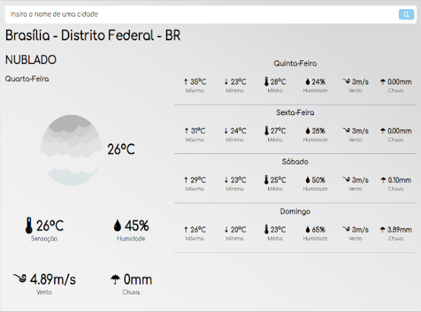
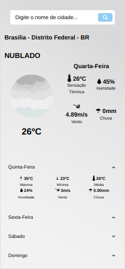

## App Previsão do Tempo

**Tecnologias utilizadas**

Este web-app foi feito com o principal objetivo de praticar/melhorar minhas habilidades com react, typescript e também um pouco de design responsivo. Foi utilizada a API do Open Weaher Map como fonte de informação!
